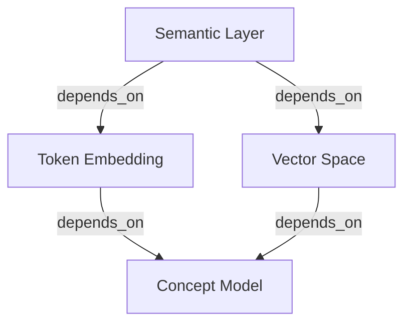

# v0.4.4d — Visualization Alternatives & Obsidian Export

> **Task:** Implement alternative visualization strategies including Obsidian graph export. This document specifies the visualization strategy comparison, export_to_obsidian.py implementation, Obsidian Markdown format with [[wikilinks]], graph screenshot capture, and Streamlit-native visualization alternatives with decision framework.

---

## Objective

Provide multiple complementary visualization approaches for the DocStratum concept map, including Neo4j Browser, Obsidian graph export, and Streamlit-native alternatives. Each approach serves different use cases and audiences. Implement export_to_obsidian.py to generate Obsidian-compatible Markdown files that enable offline graph exploration and note-taking within the Obsidian ecosystem.

---

## Scope Boundaries

| Aspect | In Scope | Out of Scope |
|--------|----------|--------------|
| **Visualization Platforms** | Neo4j Browser, Obsidian, Streamlit (networkx/pyvis) | Cytoscape.js, D3.js, custom React components |
| **Export Formats** | Obsidian Markdown (.md), JSON, CSV | PDF reports, PowerPoint slides, 3D visualizations |
| **Obsidian Features** | Wikilinks ([[concept]]), frontmatter metadata, backlinks | Obsidian plugins, community themes, sync |
| **Streamlit Graphs** | networkx layout, pyvis interactive, streamlit-agraph | Real-time streaming, live collaboration |
| **Screenshots** | Neo4j Browser graph export, ASCII art diagrams | Video recordings, animated GIFs, 3D models |
| **Decision Support** | Comparison matrices, decision trees, use case guides | Automated platform selection, ML-based recommendations |
| **Performance** | Handles 500+ concepts efficiently | Massive graphs (10k+ nodes), real-time sync |

---

## Dependency Diagram

```
┌─────────────────────────────────────────────────┐
│   Graph Population (v0.4.4c)                    │
│  populate_neo4j.py: extract, validate, load    │
└────────────────┬────────────────────────────────┘
                 │
                 ▼
┌─────────────────────────────────────────────────┐
│   Visualization Alternatives (THIS DOCUMENT)    │
│  Obsidian export, Streamlit graphs, Neo4j UI   │
└────────────────┬────────────────────────────────┘
                 │
    ┌────────────┼────────────┐
    ▼            ▼            ▼
┌─────────┐  ┌──────────┐  ┌────────────────┐
│Neo4j    │  │Obsidian  │  │Streamlit Web   │
│Browser  │  │Vault     │  │Visualization  │
│7474     │  │.md files │  │Dashboard      │
└─────────┘  └──────────┘  └────────────────┘
```

---

## 1. Visualization Strategy Comparison

### 1.1 Overview Table

| Platform | Purpose | Audience | Strengths | Limitations | Best For |
|----------|---------|----------|-----------|-------------|----------|
| **Neo4j Browser** | Interactive graph exploration | Developers, Data analysts | Real-time queries, full Cypher, pattern discovery | Requires running Neo4j, web interface | Technical exploration, debugging |
| **Obsidian Vault** | Offline note-taking + graph | Researchers, writers, learners | Markdown files, backlinks, offline access, local control | Static snapshots, manual sync | Knowledge management, long-term documentation |
| **Streamlit Web App** | Dashboard with multiple viz types | End users, teams | Custom UI, embedded in Python, easy deployment | Requires server, browser access | Interactive dashboards, presentations |
| **ASCII Diagrams** | Text-based documentation | Developers, terminal users | Version control friendly, documentation embeddable | Small graphs only (<50 nodes) | Architecture docs, README examples |
| **Static JSON/CSV** | Data export | External tools, integrations | Platform-agnostic, simple format, easy parsing | No interactivity, manual analysis | Data export, external analysis |

### 1.2 Use Case Decision Matrix

```
┌─────────────────────────────────────────────────┐
│  VISUALIZATION SELECTION DECISION TREE          │
└─────────────────────────────────────────────────┘

    START: "What do you need?"
        │
        ├─ "Interactive exploration on demand"
        │  └─→ NEO4J BROWSER
        │      Cypher queries, live filtering, pattern discovery
        │
        ├─ "Offline note-taking + linking"
        │  └─→ OBSIDIAN EXPORT
        │      Markdown files, backlinks, vault-based exploration
        │
        ├─ "Embedded in web dashboard"
        │  ├─ "Simple force-directed graph"
        │  │  └─→ STREAMLIT + NETWORKX
        │  │      Fast, minimal dependencies
        │  │
        │  └─ "Interactive zoom/pan/drag"
        │     └─→ STREAMLIT + PYVIS
        │         Full interactivity, HTML export
        │
        ├─ "Documentation/README context"
        │  ├─ "< 30 concepts shown"
        │  │  └─→ ASCII DIAGRAM
        │  │      Version control friendly
        │  │
        │  └─ "Complex architecture diagram"
        │     └─→ MERMAID/DOT DIAGRAM
        │         Rendered by many platforms (GitHub, Notion)
        │
        └─ "Data export for external tools"
           └─→ JSON/CSV EXPORT
              Generic format, tool-agnostic
```

### 1.3 Platform Feature Comparison Matrix

| Feature | Neo4j | Obsidian | Streamlit | ASCII |
|---------|-------|----------|-----------|-------|
| **Interactive Graph** | ✓ Full | ✓ Graph view | ✓ (pyvis) | ✗ |
| **Cypher Queries** | ✓ Yes | ✗ No | ✗ No | ✗ No |
| **Offline Access** | ✗ No | ✓ Full | ✗ No | ✓ Yes |
| **Custom Styling** | ✓ Limited | ✓ CSS | ✓ Full | ✓ Text |
| **Backlinks** | ~ Via queries | ✓ Built-in | ✓ Possible | ✗ No |
| **Search** | ✓ Full-text | ✓ Full-text | ✓ Filtering | ~ Grep |
| **Export** | ✓ CSV, JSON | ✓ .md, HTML | ✓ HTML, PNG | ✓ Plain text |
| **Mobile Support** | ~ Browser only | ✓ App | ~ Responsive | ✓ Text |
| **Community** | ✓ Large | ✓ Large | ✓ Large | N/A |
| **Setup Complexity** | High | Low | Low | Very low |

---

## 2. Obsidian Export Implementation (export_to_obsidian.py)

### 2.1 Core Obsidian Export Class

```python
# scripts/export_to_obsidian.py

import os
from pathlib import Path
from typing import Dict, List, Set, Tuple
from datetime import datetime
import yaml
from core.loader import load_llms_txt
from core.models import Concept

class DocStratumObsidianExporter:
    """Export DocStratum concepts to Obsidian-compatible Markdown"""

    def __init__(self, vault_path: str, concept_folder: str = "Concepts"):
        """
        Initialize exporter

        Args:
            vault_path: Path to Obsidian vault
            concept_folder: Subfolder within vault for concept notes
        """
        self.vault_path = Path(vault_path)
        self.concept_folder = self.vault_path / concept_folder
        self.concept_folder.mkdir(parents=True, exist_ok=True)

        self.exported_concepts: Set[str] = set()
        self.broken_links: List[Tuple[str, str]] = []  # (source, target)

    def export(self, llms_txt_path: str) -> Dict:
        """Export all concepts from llms.txt to Obsidian vault"""

        # Load concepts from source
        docstratum = load_llms_txt(llms_txt_path)
        all_concepts = self._collect_all_concepts(docstratum)

        # Export each concept
        for concept in all_concepts:
            self._export_concept(concept)

        # Create index file
        self._create_index(all_concepts)

        # Report
        return {
            'concepts_exported': len(self.exported_concepts),
            'broken_links': len(self.broken_links),
            'vault_path': str(self.vault_path)
        }

    def _collect_all_concepts(self, docstratum) -> List[Concept]:
        """Collect all concepts from all layers"""
        concepts = []
        concepts.extend(docstratum.master_index.concepts)
        concepts.extend(docstratum.concept_map.concepts)
        concepts.extend(docstratum.few_shot_bank.concepts)
        return concepts

    def _export_concept(self, concept: Concept):
        """Export single concept to Markdown file"""

        # Sanitize filename
        filename = self._sanitize_filename(concept.id)
        filepath = self.concept_folder / f"{filename}.md"

        # Build content
        content = self._build_concept_markdown(concept)

        # Write file
        with open(filepath, 'w', encoding='utf-8') as f:
            f.write(content)

        self.exported_concepts.add(concept.id)

    def _build_concept_markdown(self, concept: Concept) -> str:
        """Build complete Markdown content for concept"""

        lines = []

        # 1. YAML Frontmatter
        lines.append("---")
        frontmatter = self._build_frontmatter(concept)
        lines.append(yaml.dump(frontmatter, default_flow_style=False, sort_keys=False))
        lines.append("---")

        # 2. Title
        lines.append(f"# {concept.name}")
        lines.append("")

        # 3. Core Definition
        if concept.definition:
            lines.append("## Definition")
            lines.append(concept.definition)
            lines.append("")

        # 4. Metadata Section
        if hasattr(concept, 'category') and concept.category:
            lines.append("## Category")
            lines.append(f"`{concept.category}`")
            lines.append("")

        # 5. Layer Information
        lines.append("## Layer")
        layer_map = {
            'master_index': "🎯 Master Index",
            'concept_map': "🗺️  Concept Map",
            'few_shot_bank': "💾 Few-Shot Bank"
        }
        layer_display = layer_map.get(concept.layer, concept.layer)
        lines.append(f"{layer_display}")
        lines.append("")

        # 6. Dependencies (what this concept depends on)
        if hasattr(concept, 'dependencies') and concept.dependencies:
            lines.append("## Depends On")
            for dep_id in concept.dependencies:
                # Check if dependency will be exported
                wikilink = f"[[{self._format_concept_link(dep_id)}]]"
                lines.append(f"- {wikilink}")
                # Track potentially broken links
                if not self._concept_exists(dep_id):
                    self.broken_links.append((concept.id, dep_id))
            lines.append("")

        # 7. Tags/Keywords
        if hasattr(concept, 'tags') and concept.tags:
            lines.append("## Tags")
            tag_text = " ".join([f"#{tag}" for tag in concept.tags])
            lines.append(tag_text)
            lines.append("")

        # 8. Metadata Notes
        if hasattr(concept, 'metadata') and concept.metadata:
            lines.append("## Metadata")
            metadata = concept.metadata
            if isinstance(metadata, dict):
                for key, value in metadata.items():
                    lines.append(f"- **{key}**: {value}")
            lines.append("")

        # 9. Backlinks Section (Obsidian will auto-generate, but we note it)
        lines.append("## Related Concepts")
        lines.append("> Backlinks and related concepts are shown in the Obsidian Graph View")
        lines.append("")

        # 10. Source Reference
        lines.append("---")
        lines.append("*Exported from DocStratum*")
        lines.append(f"*Concept ID: `{concept.id}`*")
        lines.append(f"*Layer: {concept.layer}*")
        lines.append(f"*Last updated: {datetime.now().isoformat()}*")

        return "\n".join(lines)

    def _build_frontmatter(self, concept: Concept) -> Dict:
        """Build YAML frontmatter for concept"""
        return {
            'id': concept.id,
            'name': concept.name,
            'layer': concept.layer,
            'category': getattr(concept, 'category', ''),
            'tags': getattr(concept, 'tags', []),
            'created_at': datetime.now().isoformat(),
            'type': 'concept'
        }

    def _create_index(self, concepts: List[Concept]):
        """Create index file for vault"""
        lines = ["# DocStratum Concept Index", ""]

        # Organize by layer
        by_layer = {}
        for concept in concepts:
            layer = getattr(concept, 'layer', 'unknown')
            if layer not in by_layer:
                by_layer[layer] = []
            by_layer[layer].append(concept)

        for layer, layer_concepts in sorted(by_layer.items()):
            layer_name = {
                'master_index': '🎯 Master Index',
                'concept_map': '🗺️  Concept Map',
                'few_shot_bank': '💾 Few-Shot Bank'
            }.get(layer, layer)

            lines.append(f"## {layer_name}")
            lines.append(f"*{len(layer_concepts)} concepts*")
            lines.append("")

            for concept in sorted(layer_concepts, key=lambda c: c.name):
                wikilink = f"[[{self._format_concept_link(concept.id)}]]"
                lines.append(f"- {wikilink}")
            lines.append("")

        # Write index
        index_path = self.vault_path / "DocStratum Index.md"
        with open(index_path, 'w', encoding='utf-8') as f:
            f.write("\n".join(lines))

    def _format_concept_link(self, concept_id: str) -> str:
        """Format concept ID as Obsidian wikilink text"""
        # Use human-readable name if available, fallback to ID
        return concept_id.replace("_", " ").replace("-", " ").title()

    def _sanitize_filename(self, concept_id: str) -> str:
        """Convert concept ID to safe filename"""
        # Replace problematic characters
        safe = concept_id.replace("/", "_").replace("\\", "_")
        safe = safe.replace(":", "-").replace("|", "_")
        safe = safe.replace("<", "[").replace(">", "]")
        return safe

    def _concept_exists(self, concept_id: str) -> bool:
        """Check if concept will be exported (for validation)"""
        # This should be overridden with actual check
        return True
```

### 2.2 Obsidian Markdown Format Reference

```markdown
---
id: llm.semantic_layer
name: Semantic Layer
layer: concept_map
category: architecture
tags:
  - core
  - layers
created_at: 2024-01-20T14:30:00Z
type: concept
---

# Semantic Layer

## Definition
A layer that bridges human-interpretable concepts with their formal representations in the knowledge graph. It provides semantic mapping between natural language descriptions and structured data models.

## Category
`architecture`

## Layer
🗺️  Concept Map

## Depends On
- [[Token Embedding]]
- [[Vector Space]]
- [[Concept Model]]

## Tags
#core #layers #architecture #semantic

## Metadata
- source: docstratum.yaml
- importance: high
- reviewed: true

## Related Concepts
> Backlinks and related concepts are shown in the Obsidian Graph View

---
*Exported from DocStratum*
*Concept ID: `llm.semantic_layer`*
*Layer: concept_map*
*Last updated: 2024-01-20T14:30:00Z*
```

### 2.3 Obsidian Vault Structure

```
my-docstratum-vault/
├── DocStratum Index.md          # Main index
├── Concepts/
│   ├── Semantic Layer.md           # [[Semantic Layer]]
│   ├── Token Embedding.md          # [[Token Embedding]]
│   ├── Vector Space.md             # [[Vector Space]]
│   ├── Concept Model.md            # [[Concept Model]]
│   └── ... (500+ more concept files)
├── .obsidian/
│   ├── config.json
│   ├── plugins.json
│   └── theme/
└── README.md
```

---

## 3. Obsidian Wikilinks & Graph View

### 3.1 Wikilinks Format

```markdown
# Basic Wikilink
[[Concept Name]]

# With Display Text
[[Concept ID | Display Name]]

# Nested Path
[[Concepts/Semantic Layer]]

# Section Link
[[Semantic Layer#Definition]]

# Multiple Links
The [[Semantic Layer]] depends on [[Token Embedding]] and [[Vector Space]].
```

### 3.2 Obsidian Graph View Configuration

```json
{
  "graph": {
    "physics": {
      "barnesHut": {
        "gravitationalConstant": -8000,
        "centralGravity": 0.3,
        "springLength": 250,
        "springConstant": 0.04,
        "damping": 0.33,
        "avoidOverlap": 0.5
      },
      "enabled": true,
      "timeStep": 0.5
    },
    "display": {
      "showArrow": true,
      "linkStrength": 1,
      "nodeSize": 16,
      "linksOpacity": 1,
      "scale": 1,
      "showLabel": true,
      "fontSize": 13,
      "colorScheme": "dark"
    }
  }
}
```

### 3.3 Backlinks Detection

Obsidian automatically generates:
- **Incoming Links**: What concepts reference this one
- **Outgoing Links**: What this concept references
- **Visual Graph**: Interactive visualization of connections

---

## 4. Streamlit-Native Visualization Alternatives

### 4.1 Streamlit + NetworkX (Force-Directed Graph)

```python
# streamlit_app.py (minimal graph visualization)

import streamlit as st
import networkx as nx
import matplotlib.pyplot as plt
from neo4j import GraphDatabase

st.set_page_config(page_title="DocStratum Graph", layout="wide")

@st.cache_resource
def get_neo4j_driver():
    return GraphDatabase.driver("bolt://localhost:7687",
                               auth=("neo4j", "password123"))

def load_graph_from_neo4j(driver):
    """Load concept graph from Neo4j"""
    G = nx.DiGraph()

    with driver.session() as session:
        # Load nodes
        result = session.run("MATCH (c:Concept) RETURN c.id, c.name, c.layer")
        for record in result:
            G.add_node(record['c.id'],
                      name=record['c.name'],
                      layer=record['c.layer'])

        # Load edges
        result = session.run(
            "MATCH (a:Concept) -[r:DEPENDS_ON]-> (b:Concept) RETURN a.id, b.id"
        )
        for record in result:
            G.add_edge(record['a.id'], record['b.id'])

    return G

def main():
    st.title("DocStratum Concept Graph")

    col1, col2 = st.columns([3, 1])

    with col1:
        st.subheader("Graph Visualization")

        driver = get_neo4j_driver()
        G = load_graph_from_neo4j(driver)

        # Layout
        pos = nx.spring_layout(G, k=2, iterations=50, seed=42)

        # Create figure
        fig, ax = plt.subplots(figsize=(14, 10))

        # Color by layer
        layer_colors = {
            'master_index': '#FF6B6B',
            'concept_map': '#4ECDC4',
            'few_shot_bank': '#45B7D1'
        }

        for node in G.nodes():
            layer = G.nodes[node]['layer']
            color = layer_colors.get(layer, '#999999')
            ax.scatter(pos[node][0], pos[node][1],
                      s=300, c=color, alpha=0.7, zorder=3)

        # Draw edges
        nx.draw_networkx_edges(G, pos, ax=ax,
                             arrowsize=10, alpha=0.3, width=0.5)

        # Labels
        labels = {node: G.nodes[node]['name'] for node in G.nodes()}
        nx.draw_networkx_labels(G, pos, labels, ax=ax, font_size=8)

        ax.axis('off')
        st.pyplot(fig)

    with col2:
        st.subheader("Statistics")
        st.metric("Concepts", len(G.nodes()))
        st.metric("Dependencies", len(G.edges()))

        # Layer distribution
        layers = {}
        for node in G.nodes():
            layer = G.nodes[node]['layer']
            layers[layer] = layers.get(layer, 0) + 1

        st.write("**By Layer:**")
        for layer, count in sorted(layers.items()):
            st.write(f"- {layer}: {count}")

if __name__ == '__main__':
    main()
```

### 4.2 Streamlit + Pyvis (Interactive 3D/2D Graph)

```python
# streamlit_pyvis_app.py (interactive graph with pan/zoom)

import streamlit as st
import networkx as nx
from pyvis.network import Network
from neo4j import GraphDatabase
import tempfile
import os

st.set_page_config(page_title="DocStratum Interactive Graph", layout="wide")

@st.cache_resource
def get_driver():
    return GraphDatabase.driver("bolt://localhost:7687",
                               auth=("neo4j", "password123"))

def load_graph_from_neo4j(driver, layer_filter=None):
    """Load and filter concept graph"""
    G = nx.DiGraph()

    with driver.session() as session:
        # Load nodes
        if layer_filter:
            query = f"MATCH (c:Concept {{layer: '{layer_filter}'}}) RETURN c.id, c.name"
        else:
            query = "MATCH (c:Concept) RETURN c.id, c.name"

        result = session.run(query)
        for record in result:
            G.add_node(record['c.id'], label=record['c.name'])

        # Load edges (only between selected nodes)
        node_ids = list(G.nodes())
        result = session.run(
            f"MATCH (a:Concept) -[r:DEPENDS_ON]-> (b:Concept) WHERE a.id IN {node_ids} AND b.id IN {node_ids} RETURN a.id, b.id"
        )
        for record in result:
            G.add_edge(record['a.id'], record['b.id'])

    return G

def create_pyvis_network(G, physics=True):
    """Create interactive Pyvis network"""
    net = Network(directed=True, physics=physics, height="750px")
    net.from_nx(G)

    # Styling
    for node in net.nodes:
        node['size'] = 30
        node['font'] = {'size': 14}
        node['title'] = node['label']

    for edge in net.edges:
        edge['arrows'] = 'to'
        edge['color'] = {'color': 'rgba(0,0,0,0.2)'}

    return net

def main():
    st.title("🗺️  DocStratum Interactive Graph")

    col1, col2 = st.columns([1, 4])

    with col1:
        st.subheader("Controls")

        layer_filter = st.selectbox(
            "Filter by Layer",
            options=[None, "master_index", "concept_map", "few_shot_bank"],
            format_func=lambda x: "All Concepts" if x is None else x
        )

        physics = st.toggle("Enable Physics Simulation", value=True)

        search_term = st.text_input("Search Concepts", "")

    with col2:
        driver = get_driver()
        G = load_graph_from_neo4j(driver, layer_filter)

        # Filter by search
        if search_term:
            filtered_nodes = [n for n in G.nodes()
                            if search_term.lower() in n.lower()]
            G = G.subgraph(filtered_nodes).copy()

        # Create and display network
        net = create_pyvis_network(G, physics=physics)

        # Save to temporary HTML file
        with tempfile.NamedTemporaryFile(mode='w', suffix='.html', delete=False) as f:
            net.show(f.name)
            html_file = f.name

        # Display in Streamlit
        with open(html_file) as f:
            html_content = f.read()
            st.components.v1.html(html_content, height=750)

        # Cleanup
        os.unlink(html_file)

        # Stats
        st.write(f"**Graph Statistics:** {len(G.nodes())} concepts, {len(G.edges())} dependencies")

if __name__ == '__main__':
    main()
```

### 4.3 Library Comparison

| Library | Graph Type | Interactivity | Performance | Best For |
|---------|-----------|---|---|---|
| **NetworkX + Matplotlib** | Static | None | Fast | Simple diagrams, docs |
| **Pyvis** | Interactive | Excellent | Good | Exploratory, presentations |
| **Streamlit-Agraph** | Interactive | Good | Good | Streamlit integration |
| **Plotly** | Interactive | Excellent | Moderate | Web dashboards |
| **Cytoscape.js** | Interactive | Full | Excellent | Complex interactions |

---

## 5. Graph Screenshot & Documentation Capture

### 5.1 Screenshot Capture Strategy

```python
# scripts/capture_graph_screenshots.py

from selenium import webdriver
from neo4j import GraphDatabase
import time
from pathlib import Path

def capture_neo4j_browser_screenshot(output_path: str):
    """Capture Neo4j Browser graph visualization"""

    driver = webdriver.Chrome()

    try:
        # Open Neo4j Browser
        driver.get("http://localhost:7474")

        # Wait for load
        time.sleep(3)

        # Click on the graph tab if needed
        # Execute a sample query
        driver.find_element("xpath", "//textarea[@class='editor']").send_keys("""
MATCH (c:Concept) -[r:DEPENDS_ON]-> (dep)
RETURN c, r, dep
LIMIT 100
        """)

        # Run query (Ctrl+Enter)
        driver.find_element("xpath", "//textarea[@class='editor']").send_keys("\uE008\uE015")
        time.sleep(3)

        # Screenshot
        driver.save_screenshot(output_path)
        print(f"✓ Screenshot saved to {output_path}")

    finally:
        driver.quit()

def generate_mermaid_graph(max_nodes: int = 50) -> str:
    """Generate Mermaid diagram from Neo4j"""

    with GraphDatabase.driver("bolt://localhost:7687",
                            auth=("neo4j", "password123")) as driver:
        with driver.session() as session:
            # Get limited set of concepts and relationships
            result = session.run(f"""
MATCH (c:Concept) -[r:DEPENDS_ON]-> (dep)
RETURN c.id, c.name, dep.id, dep.name
LIMIT {max_nodes}
            """)

            lines = ["graph TD"]
            seen_nodes = set()

            for record in result:
                source_id = record['c.id']
                source_name = record['c.name']
                target_id = record['dep.id']
                target_name = record['dep.name']

                # Add nodes
                if source_id not in seen_nodes:
                    lines.append(f"    {source_id}[{source_name}]")
                    seen_nodes.add(source_id)

                if target_id not in seen_nodes:
                    lines.append(f"    {target_id}[{target_name}]")
                    seen_nodes.add(target_id)

                # Add edge
                lines.append(f"    {source_id} -->|depends_on| {target_id}")

            return "\n".join(lines)

# Mermaid diagram output
mermaid_diagram = generate_mermaid_graph()
print(mermaid_diagram)

# Usage in Markdown:
# ```mermaid
# [mermaid_diagram here]
# ```
```

### 5.2 Mermaid Diagram Example

````markdown

````

---

## 6. Decision Framework for Visualization Choice

### 6.1 Decision Matrix (Detailed)

```
DECISION FRAMEWORK
==================

Question 1: What is your primary use case?
├─ A) Exploring the graph interactively
│  └─→ Go to Q2
├─ B) Taking notes and linking ideas
│  └─→ Obsidian (v0.4.4d - Obsidian Export)
├─ C) Building a web dashboard
│  └─→ Go to Q3
└─ D) Documenting architecture
   └─→ ASCII/Mermaid diagrams

Question 2: Do you need to run database queries?
├─ A) Yes, I need Cypher query capability
│  └─→ NEO4J BROWSER (http://localhost:7474)
│      • Full query language
│      • Real-time pattern discovery
│      • Debugging capabilities
├─ B) No, just browse the graph
│  └─→ Go to Q3

Question 3: Do you need offline access?
├─ A) Yes, must work offline
│  └─→ OBSIDIAN EXPORT (v0.4.4d)
│      • Local .md files
│      • Works without internet
│      • Sync to other devices via vault
├─ B) No, always has internet/server
│  └─→ Go to Q4

Question 4: How many concepts to visualize?
├─ A) < 50 concepts
│  └─→ ASCII or Static Diagram
│      • Version control friendly
│      • Fast rendering
│      • Documentation-friendly
├─ B) 50-500 concepts
│  └─→ STREAMLIT + PYVIS
│      • Interactive, responsive
│      • Deployable web app
│      • Good for demos/presentations
└─ C) > 500 concepts
   └─→ NEO4J BROWSER (with filtering)
      or STREAMLIT + NEO4J direct query
      • Handle large graphs
      • Query-based filtering
```

### 6.2 Recommendation Quick Reference

```
YOUR SITUATION              →    RECOMMENDED SOLUTION
─────────────────────────────────────────────────────
Want to explore live        →    Neo4j Browser (7474)
Research/note-taking        →    Obsidian Export
Web dashboard/presentation  →    Streamlit + Pyvis
Documentation/architecture  →    Mermaid/ASCII diagrams
External tool integration   →    JSON/CSV export
Team collaboration          →    Combine Neo4j + Obsidian
Large enterprise deploy     →    Streamlit web app
Single developer            →    Obsidian or Neo4j Browser
Teaching/learning           →    Streamlit for interactivity
Mobile access               →    Obsidian (with mobile sync)
```

---

## Deliverables Checklist

- [ ] DocStratumObsidianExporter class fully implemented
- [ ] Concept export to individual Markdown files working
- [ ] YAML frontmatter generation for Obsidian metadata
- [ ] Wikilinks ([[concept]]) properly formatted
- [ ] Dependency tracking and broken link detection
- [ ] Index file creation with layer organization
- [ ] Obsidian vault structure documentation created
- [ ] Streamlit + NetworkX visualization app working
- [ ] Streamlit + Pyvis interactive graph app working
- [ ] Graph physics simulation configurable
- [ ] Search/filter functionality in Streamlit apps
- [ ] Selenium screenshot capture script created
- [ ] Mermaid diagram generation from Neo4j
- [ ] Visualization comparison matrix completed
- [ ] Decision framework and decision tree created

---

## Acceptance Criteria

- [ ] Obsidian export creates 500+ valid .md files
- [ ] All wikilinks ([[concept]]) render correctly in Obsidian
- [ ] Obsidian graph view shows correct dependencies
- [ ] Frontmatter contains all required metadata fields
- [ ] Index file lists all concepts organized by layer
- [ ] Broken links are tracked and reported
- [ ] Streamlit NetworkX app renders graph in <2 seconds
- [ ] Streamlit Pyvis app is fully interactive (pan, zoom, drag)
- [ ] Layer filter works correctly in both Streamlit apps
- [ ] Search functionality finds concepts by name
- [ ] Neo4j Browser access confirmed at http://localhost:7474
- [ ] Screenshot capture generates usable images
- [ ] Mermaid diagrams render in GitHub/Notion/Markdown viewers
- [ ] Decision matrix helps users choose appropriate platform
- [ ] Documentation includes setup instructions for each platform

---

## Next Step

→ **v0.5.0 — Integration & Production Deployment**

Integrate all v0.4.x components (schema, Docker, population, visualization) into a cohesive system. Create deployment automation, documentation, and monitoring for optional Neo4j support in DocStratum.
